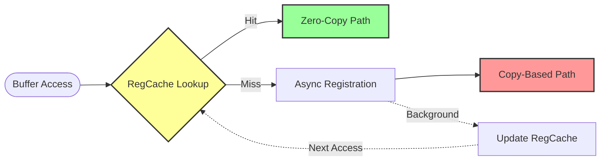
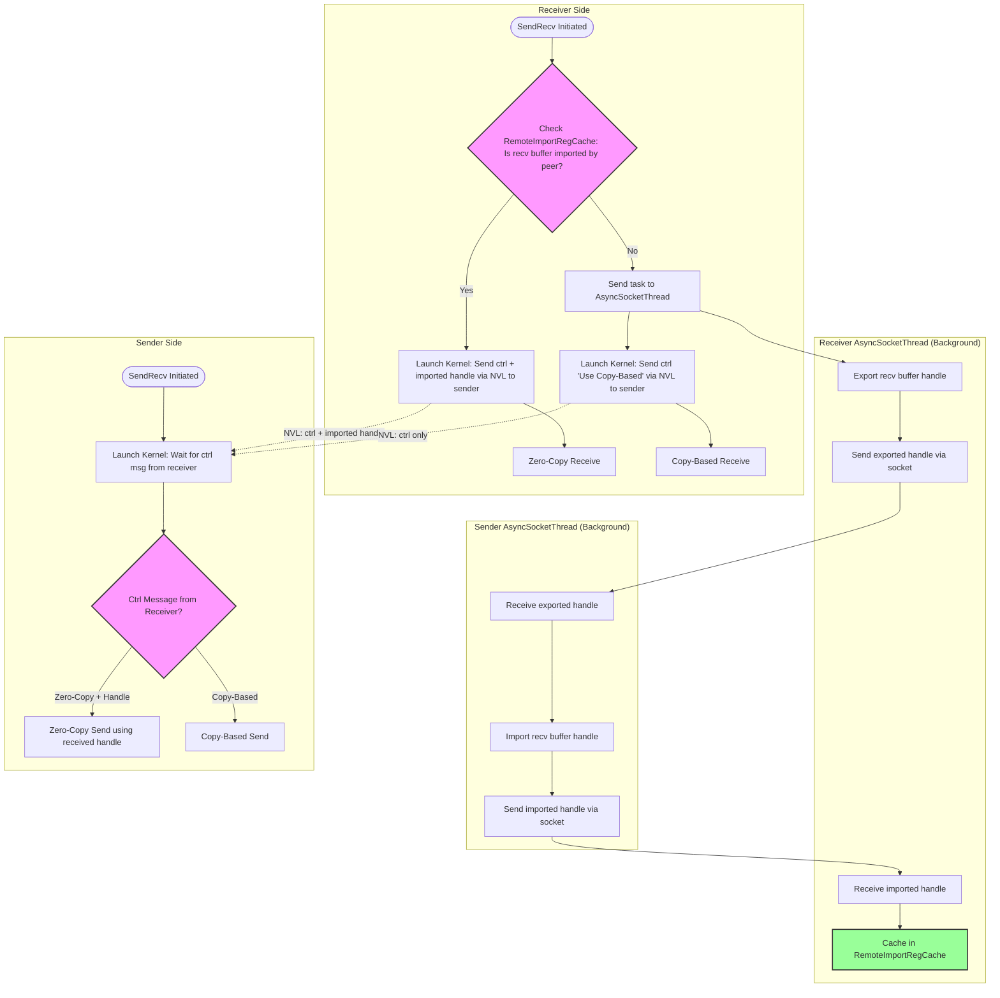
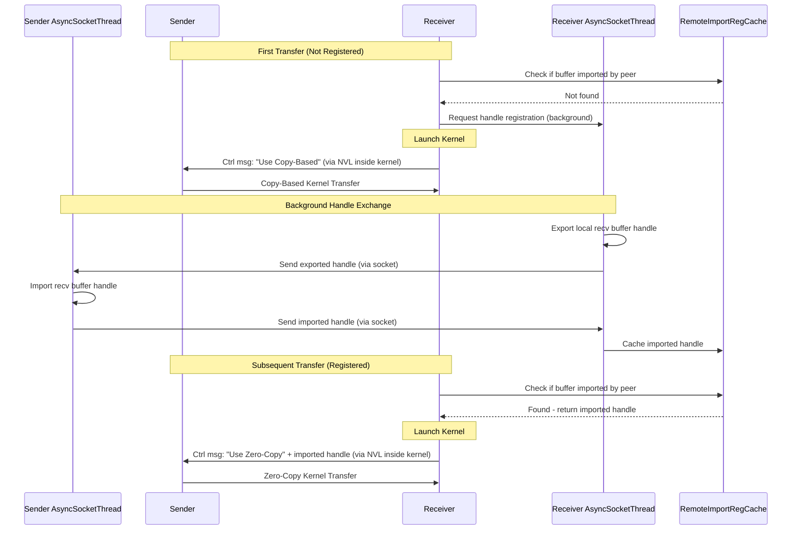
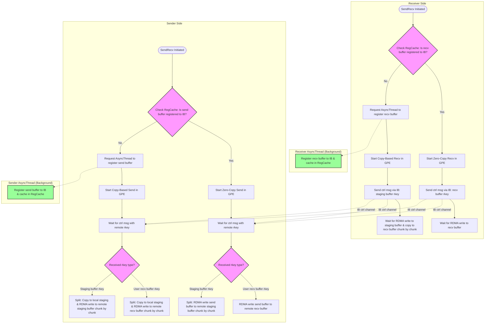
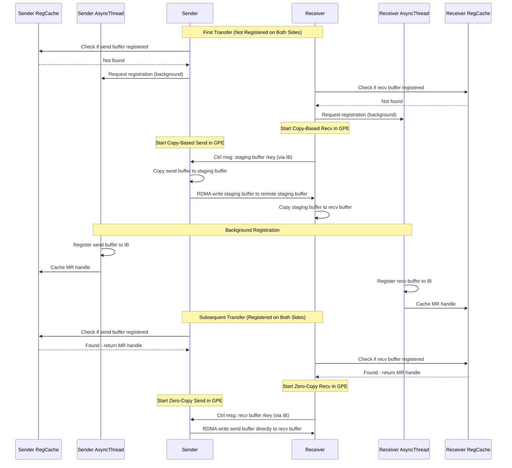

# CTRAN Adaptive Data Transfer Mechanism

This document describes CTRAN's adaptive data transfer mechanism, including copy-based and zero-copy detection, auto-switch logic, and background memory registration workflow for both NVL and IB backends.

## Overview

CTRAN implements an adaptive data transfer mechanism that automatically switches between **copy-based** and **zero-copy** transfers based on buffer registration status. The core workflow is:
1. **Check RegCache**: Determine if the buffer is registered in the registration cache
2. **If Registered**: Run zero-copy transfer using the handle from cache
3. **If Not Registered**: Request async thread to register memory, then run copy-based transfer

### Benefits

- **Easier Adoption**: Users can seamlessly adopt CTRAN collectives and achieve best performance regardless of whether memory is pre-registered or not
- **Better NVL Zero-Copy Performance**: The new design eliminates CPU-kernel synchronization overhead on the fast path, closing performance gaps with baseline kernels (see [Ctran Zero-Copy Kernel Performance Gap and New Design](https://docs.google.com/document/d/1DSsM5mvzv1esQ09Yd5t6uf0jaeXx4wMGGapYLo8hyd4/edit?tab=t.0#heading=h.g0rbvjc2q7zx))
- **Optimal Performance for Repeated Operations**: Once buffers are registered, subsequent operations use zero-copy path
- **Graceful Fallback**: First-time or unregistered buffers safely use copy-based transfer

---

## NVL Backend

### Key Concepts

- **Export Handle**: Local GPU memory handle that can be shared with remote peers
- **Import Handle**: Remote peer's exported handle that has been imported locally
- **RemoteImportRegCache**: Caches imported handles from remote peers
  - **Key**: (receive buffer address, peer rank)
  - **Value**: Peer-imported buffer address
- **AsyncSocketThread**: Background thread that handles handle export/import via socket

### NVL Workflow Diagram

### NVL Transfer Sequence

---

## IB Backend

### Key Concepts

- **Memory Registration (MR)**: Register GPU/host memory with IB hardware for RDMA operations
- **RegCache**: Caches local MR (memory region) handles for send/recv buffers
- **AsyncThread**: Background thread that registers memory with IB
- **rkey**: Remote key that allows remote peer to access registered memory via RDMA
- **Staging Buffer**: Pre-registered intermediate buffer used when user buffer is not registered

### IB Workflow Diagram

The sender and receiver sides operate **independently** - the only coordination is the receiver sending either:
- **recv buffer rkey** (for zero-copy receive)
- **staging buffer rkey** (for copy-based receive)

The sender always performs zero-copy RDMA write to the given rkey, but may need to copy to its own staging buffer first if the send buffer is not registered.

> **Layout Note**: Receiver is on the left, Sender is on the right.

### IB Transfer Sequence

---

## Key Implementation Notes

1. **Thread Safety**: RegCache must be thread-safe as it's accessed by both data path and async registration threads
2. **Memory Lifetime**: Registered memory must remain valid while handles are cached
3. **Cache Invalidation**: Handles must be invalidated when memory is freed or remapped
4. **Ctrl Message Ordering**: For NVL, ctrl message is sent inside kernel; for IB, GPE starts first then sends ctrl message
5. **IB Independence**: Sender and receiver sides make independent decisions about copy-based vs zero-copy based on their own buffer registration status
