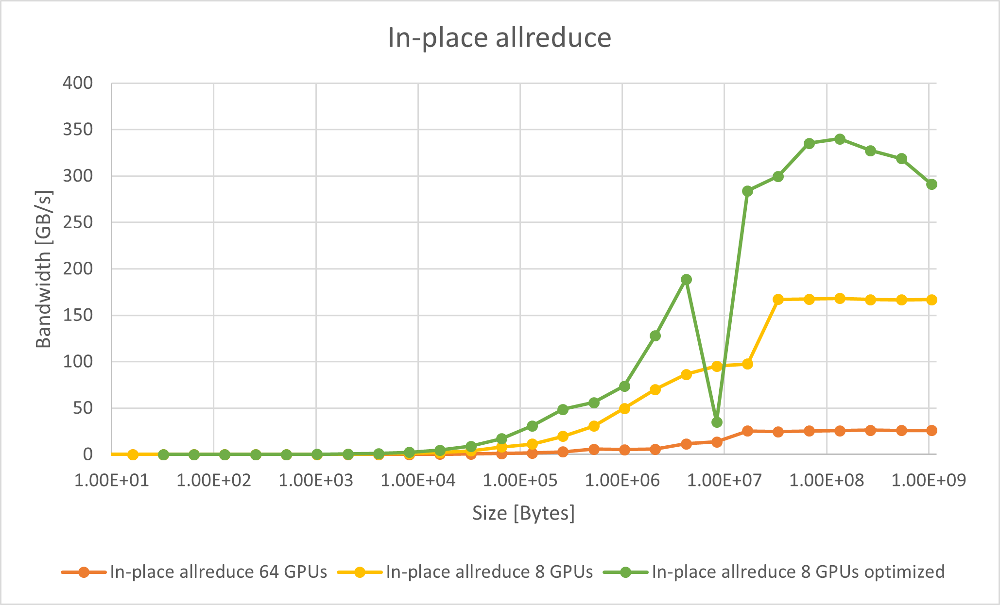
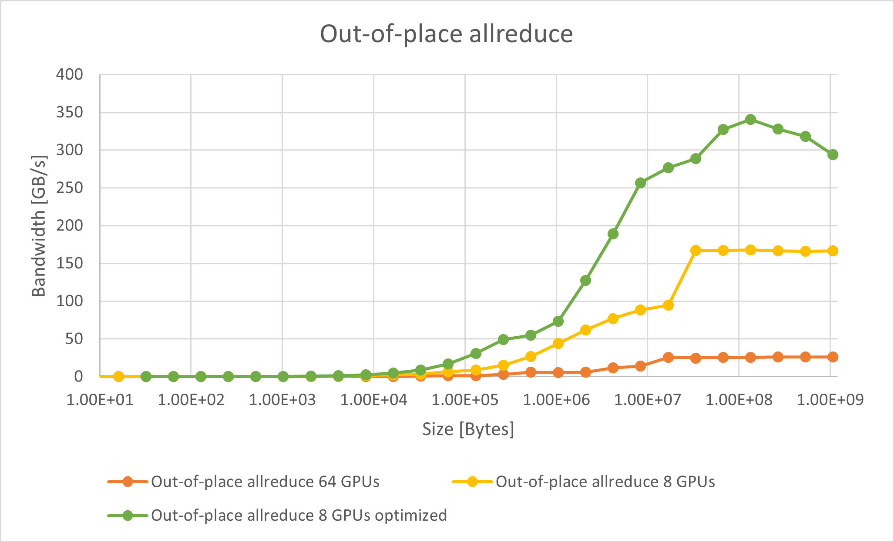

.. meta::
   :description: Usage tips for the RCCL library of collective communication primitives
   :keywords: RCCL, ROCm, library, API, peer-to-peer, transport

.. _rccl-usage-tips:

*****************************************
RCCL usage tips
*****************************************

This topic describes some of the more common RCCL extensions, such as NPKit, and provides tips on how to
configure and customize the application.

NPKit
=====

RCCL integrates `NPKit <https://github.com/microsoft/npkit>`_, a profiler framework that
enables the collection of fine-grained trace events in RCCL components, especially in giant collective GPU kernels.
See the `NPKit sample workflow for RCCL <https://github.com/microsoft/NPKit/tree/main/rccl_samples>`_ for
a fully-automated usage example. It also provides useful templates for the following manual instructions.

To manually build RCCL with NPKit enabled, pass ``-DNPKIT_FLAGS="-DENABLE_NPKIT -DENABLE_NPKIT_...(other NPKit compile-time switches)"`` to the ``cmake`` command.
All NPKit compile-time switches are declared in the RCCL code base as macros with the prefix ``ENABLE_NPKIT_``.
These switches control the information that is collected.

.. note::

   NPKit only supports the collection of non-overlapped events on the GPU.
   The ``-DNPKIT_FLAGS`` settings must follow this rule.

To manually run RCCL with NPKit enabled, set the environment variable ``NPKIT_DUMP_DIR``
to the NPKit event dump directory. NPKit only supports one GPU per process.
To manually analyze the NPKit dump results, use `npkit_trace_generator.py <https://github.com/microsoft/NPKit/blob/main/rccl_samples/npkit_trace_generator.py>`_.

Enabling peer-to-peer transport
===============================

To enable peer-to-peer access on machines with PCIe-connected GPUs,
set the HSA environment variable as follows:

.. code-block:: shell

   HSA_FORCE_FINE_GRAIN_PCIE=1

This feature requires GPUs that support peer-to-peer access along with
proper large BAR addressing support.

Improving performance on the MI300X
===================================

This section outlines ways to improve RCCL performance on MI300X systems,
including guidelines for systems with fewer than eight GPUs and the most efficient
GPU partition modes.

Configuration with fewer than eight GPUs
----------------------------------------

On a system with eight MI300X accelerators, each pair of accelerators is
connected with dedicated Infinity Fabric™ links in a fully connected topology.
For collective operations, this can achieve good performance when all eight
accelerators (and all Infinity Fabric links) are used. When fewer than eight
GPUs are used, however, this can only achieve a fraction of the potential
bandwidth on the system. However, if your workload warrants using fewer than
eight MI300X accelerators on a system, you can set the run-time variable
``NCCL_MIN_NCHANNELS`` to increase the number of channels. For example:

.. code-block:: shell

   export NCCL_MIN_NCHANNELS=32

Increasing the number of channels can benefit performance, but it also increases
GPU utilization for collective operations.
Additionally, RCCL pre-defines a higher number of channels when only two or four
accelerators are in use on a 8\*MI300X system. In this situation, RCCL uses 32
channels with two MI300X accelerators and 24 channels for four MI300X
accelerators.

.. _nps4_cpx_mi300_rccl:

NPS4 and CPX partition modes
----------------------------

The term compute partitioning modes, or Modular Chiplet Platform (MCP), refers to the
logical partitioning of XCDs into devices in the ROCm stack. The names are
derived from the number of logical partitions that are created out of the eight
XCDs. In the default mode, SPX (Single Partition X-celerator), all eight XCDs are
viewed as a single logical compute element, meaning that the :doc:`amd-smi <amdsmi:index>`
utility will show a single MI300X device. In CPX (Core Partitioned X-celerator)
mode, each XCD appears as a separate logical GPU, for example, as eight separate
GPUs in :doc:`amd-smi <amdsmi:index>` per MI300X. CPX mode can be viewed as
having explicit scheduling privileges for each individual compute element (XCD).

While compute partitioning modes change the space on which you can assign work
to compute units, the memory partitioning modes (known as Non-Uniform Memory
Access (NUMA) Per Socket (NPS)) change the number of NUMA domains that a device
exposes. In other words, it changes the number of HBM stacks which are
accessible to a compute unit, and therefore the size of its memory space. However,
for the MI300X, the number of memory partitions must be less than or equal to
the number of compute partitions. NPS4 (viewing pairs of HBM stacks as a
disparate element), for example, is only enabled when in CPX mode (viewing each
XCD as a disparate element).

- Compute partition modes

  - In SPX mode, workgroups launched to the device are distributed
    round-robin to the XCDs in the device, meaning that the programmer cannot
    have explicit control over which XCD a workgroup is assigned to.

  - In CPX mode, workgroups are launched to a single XCD, meaning the
    programmer has explicit control over work placement onto the XCDs.

- Memory partition modes

  - In NPS1 mode (compatible with CPX and SPX), the entire memory is accessible
    to all XCDs.

  - In NPS4 mode (compatible with CPX), each memory quadrant of the memory is
    directly visible to the logical devices in its quadrant. An XCD can still
    access all portions of memory through multi-GPU programming techniques.

The MI300 CPX mode can be accessed using the following :doc:`amdsmi:index`
commands.

.. code-block:: shell

   amd-smi set --gpu all --compute-partition CPX
   amd-smi set --gpu all --memory-partition NPS4

RCCL performance with CPX and NPS4
^^^^^^^^^^^^^^^^^^^^^^^^^^^^^^^^^^

To run RCCL allreduce on 64 GPUs with CPX+NPS4 mode on the MI300X, use this
example:

.. code-block:: shell

   mpirun -np 64 --bind-to numa rccl-tests/build/all_reduce_perf -b 8 -e 1G -f 2 -g 1

To run RCCL allreduce on 8 GPUs in the same OAM with CPX+NPS4 mode on the
MI300X, use this example:

.. code-block:: shell

   export ROCR_VISIBLE_DEVICES=0,1,2,3,4,5,6,7

   mpirun -np 8 --bind-to numa rccl-tests/build/all_reduce_perf -b 8 -e 1G -f 2 -g 1

RCCL delivers improved allreduce performance in CPX mode for TP=8 (8 GPUs in
the same OAM) on the MI300X.

.. code-block:: shell

   export HIP_FORCE_DEV_KERNARG=1

   export ROCR_VISIBLE_DEVICES=0,1,2,3,4,5,6,7

   mpirun -np 8 --bind-to numa rccl-tests/build/all_reduce_perf -b 32 -e 1G -f 2 -g 1 -G 2 -w 20 -n 50

Here are the benchmark results for in-place (where the output buffer is used as
the input buffer) and out-of-place allreduce bus bandwidth.

A significant performance improvement is achievable with optimized CPX mode,
which peaks at ~340 GB/s with a single OAM. The difference in bus bandwidth
between the unoptimized and optimized modes increases as the buffer size grows.

Using RCCL and CPX in PyTorch
^^^^^^^^^^^^^^^^^^^^^^^^^^^^^

The PyTorch all_reduce benchmark is used to reproduce the performance reported
by RCCL-Tests with the RCCL and CPX optimizations.

.. note::

   To use RCCL with CPX mode in PyTorch, check the RCCL version used by PyTorch.

   For a virtualenv with a .whl-based PyTorch setup (such as nightly/rocm6.2),
   this would be in
   ``<path-to-your-venv>/lib/<python-version>/site-packages/torch/lib/librccl.so``
   This is the version of RCCL that is packaged as part of ROCm version 6.2.

   RCCL for CPX mode was enabled in ROCm 6.3.0. To use the CPX features, replace
   the existing ``librccl.so`` with one from ROCm 6.3.0 or newer or from a local
   build of the RCCL develop branch.

To test the effects of RCCL on PyTorch, the `stas00 all reduce benchmark <https://github.com/stas00/ml-engineering/blob/master/network/benchmarks/all_reduce_bench.py>`_
was used. The following command is used to run a single OAM allreduce
benchmark:

.. code-block:: shell

   export ROCR_VISIBLE_DEVICES=0,1,2,3,4,5,6,7
   python -u -m torch.distributed.run --nproc_per_node=8 --rdzv_endpoint localhost:6000  --rdzv_backend c10d all_reduce_bench.py

For better performance, the ``HIP_FORCE_DEV_KERNARG``,
and ``TORCH_NCCL_USE_TENSOR_REGISTER_ALLOCATOR_HOOK`` environment variables are
set during the benchmark in the following manner:

.. code-block:: shell

   export TORCH_NCCL_USE_TENSOR_REGISTER_ALLOCATOR_HOOK=1
   export HIP_FORCE_DEV_KERNARG=1
   export ROCR_VISIBLE_DEVICES=0,1,2,3,4,5,6,7
   python -u -m torch.distributed.run --nproc_per_node=8 --rdzv_endpoint localhost:6000  --rdzv_backend c10d all_reduce_bench.py

The default allreduce PyTorch benchmark peak bus bandwidth performance is
~170 GB/s on a single OAM with ROCm 6.2.4, while the optimized run for CPX on a
single OAM peaks at ~315 GB/s.
